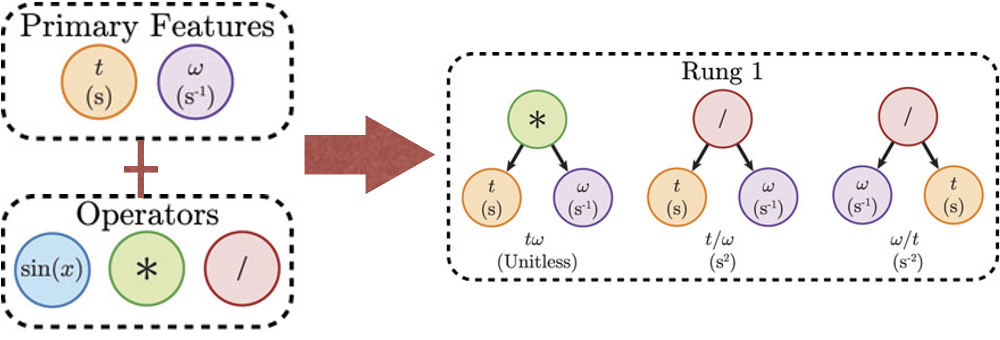
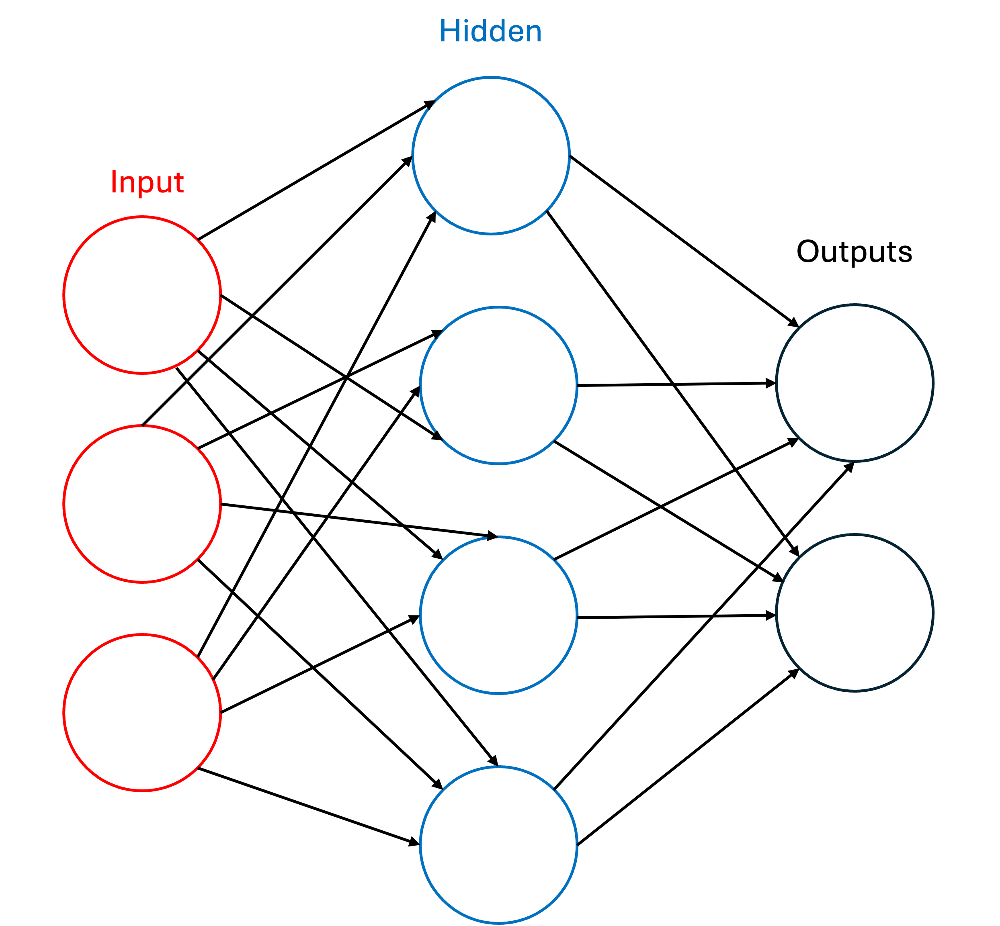
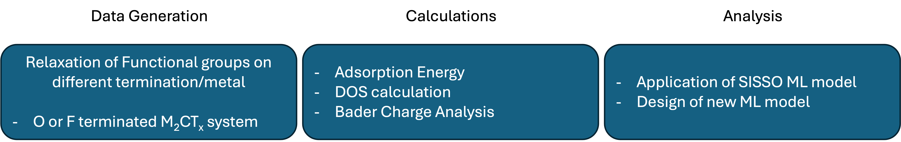
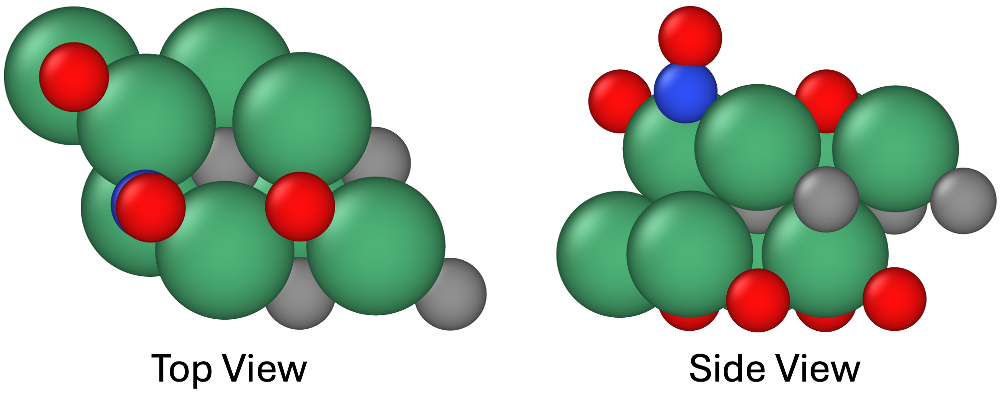

## Course Project Logistics ##

1. [Introduction](#intro)
2. [Motivation](#MO)
3. [Terms to Know](#Terms)
4. [Plan](#Plan)
5. [Individual Tasks](#ind)
6. [Final Report](#final)

Turn in your final report on CANVAS or email to:

```
alevoj@seas.upenn.edu, hsang@seas.upenn.edu
```

<a name='intro'></a>

## Project Introduction ##
Material: MXenes are an emerging family of two-dimensional transition metal carbides and nitrides with the general formula M<sub>n+1</sub>X<sub>n</sub>T<sub>x</sub> (n = 1-4), where M is an early transition metal (Sc, Ti, Zr, V, Nb, Ta, etc), X is C or N, and T is a surface group such as O, F, Cl, and OH. Its main properties are: scalable synthesis, solution processability, large surface-to-volume ratio, high metallic conductivity, and mechanical strength. Due to these properties, applications for energy storage, composites, and optoelectronics are being explored.

Goal: The main scientific goal is to find an analytic model for functionalized M<sub>2</sub>C MXenes utilizing the data generated from class and the lab. First, we will look at the O-, F-terminated M<sub>2</sub>C MXenes(M = Ti, V, Zr, Nb, Mo, Hf, Ta, W) and adsorb gas molecules(nitrogen oxide, phosphine, sulfur oxide, acid, aldehyde, phosphate, carbon oxide) on face cubic centered(fcc) site and find a thermodynamically optimal adsorption configuration by calculating the adsorption energy and we will run DOS, bader charge calculations to further analyze the system. Our final objective will be to utilize the generated data and design a machine learning model that can predict the adsorption stability of functional groups on MXenes. 

<a name='MO'></a>

### Motivation ###

- **Adsorption of Gas Molecules on MXenes**: MXene is a 2 dimensional transitional metal carbide or nitride which allows the material to be easily tunable with surface modification to have drastically different properties. Utilizing this unique characteristic of MXene, it is currently being explored as a potential source for gas sensing material that much more tunable than conventional metal oxide sensors.

- **Adsorption Configuration and Optimization**: By modeling different surface configuration of the adsorption, we gain insight into how environmental conditions (vacancy, termination, temperature, etc.) and configuration influence the adsorption stability. This could lead to optimization strategies that improve catalyst activity and stability by tuning vacancy rates and ligand environment.

- **Design of Machine Learning Model for Prediction**: Selecting MXenes for application based on the affinity with the functional group is crucial, especially for sensing. Machine learning model provides insight in the affinity of functional groups with the MXene using less computational resources than running actual DFT calculations, and results of prediction from given dataset gives insight on how to improve the model. 

- **Experimental Comparison and Data Validation**: By aligning the surface configuration and adsorption predicted in simulations with those measured experimentally, we can validate our models and refine predictive accuracy. This comparison helps identify discrepancies, improve our understanding of real-world conditions, and build confidence in the applicability of the computational framework for guiding experimental design and optimizing catalyst performance.

<a name='Terms'></a>

## Terminology ##
- **High Symmetry Adsorption Sites**: FCC(Face-Centered Cubic), HCP(Hexagonal Close-Packed), TOP(Directly on surface metal site) and Bridge(Located halfway between two surface atoms, over the bond connecting them) are specific locations on a crystal surface with the highest degree of symmetry where functional groups or termination can bind.

- **Termination**: Termination refers to the specific arrangement and coordination of surface groups that are adsorbed to MXene during the synthesis of MXene from MAX phase. Different terminations, whether H, Cl, O, F, or OH significantly affect surface properties, including reactivity and stability, and can result from various synthesis methods.

- **Functional Groups**: Functional Groups refers to the specific groups that are adsorbed on the MXene through nucleophilic substitution of the termination with anion donors or by applying electrochemical potential to have partial elimination of termination group to adsorb designated functional groups.
  
- **Adsorption Energy**: Adsorption energy refers the the potential energy difference between the initial system and final system, where th energy of initial system are defined as  addition of adsorbate and adsorbent and energy of the final system is defined as the combined system's total potential energy. Thus the equation is defined as:
  E<sub>ads</sub> = E<sub>final</sub> -E<sub>init</sub>

- **Bader Charge Analysis**: Bader charge analysis is a computational method for partitioning a charge density grid into Bader(atomic) volumes. Bader volume is defined as a volume that contains a single charge density maximum, and is separated from other volumes by surfaces(zero-flux surface) where the charge density is the minimum normal to the surface. Charge density analysis is useful technique to compare your results with experimental results because it is an observable quantity that can be measured or calculated experimentally, while being insensitive to the basis set used.

- **Symbolic Regression**: It is a type of regression analysis that searches the space of mathematical expressions to find the model that best fits a given dataset, both in terms of accuracy and simplicity. Initial expressions are formed by randomly combining mathematical building blocks such as mathematical operators, analytic functions, constants, and state variables where you can define 'rung' to decide how many degrees away you define the parameters. As it generates new parameters based on the parameters given, we can get uncover the intrinsic relationships of the dataset which leads to chemical intuition we can then apply to improve the model. 


- **Neural Network**: A neural network consists of connected units known as artificial neurons which are connected to each other by edges. Each artificial neuron receives signals from connected neurons, then processes them and sends a signal to other connected neurons. The output of each neuron(a real number referred as signal) is computed by some non linear function of the totality of its inputs which is called the activation function. The strength of the signal at each connection is determined by a weight which is adjusted during training process. Groups of neurons are aggregated into layers, and each layer performs a transformation on its inputs. Signals travel from the first layer(the input layer) to the last layer(the output layer), passing through multiple intermediate layers(hidden layers). If a network has at least two hidden layers it is called a deep neural network. Deep neural networks are capable of learning sophisticated hierarchical representations.


<a name='Plan'></a>

## Plan ##

For the overall process, we need to go through the following path.



<a name='ind'></a>
### Detailed plan for Individual tasks ###

We will break into groups of 3-4 students and each group will be assigned a series of MXenes and functional groups.
   
       a. Functional group : H<sub>3</sub>PO<sub>4</sub>, PH<sub>3</sub>, HCHO, NO, NO<sub>2</sub>, N<sub>2</sub>O
          Metal : Ti, V, Zr, Nb - Group1

       b. Functional group : H<sub>3</sub>PO<sub>4</sub>, PH<sub>3</sub>, HCHO, NO, NO<sub>2</sub>, N<sub>2</sub>O
          Metal : Mo, Hf, Ta, W - Group2

       c. Functional group : SO<sub>3</sub>, SO<sub>2</sub>, HCN, CO<sub>2</sub>, CO, H<sub>2</sub>S
          Metal : Ti, V, Zr, Nb - Group3

       d. Functional group : SO<sub>3</sub>, SO<sub>2</sub>, HCN, CO<sub>2</sub>, CO, H<sub>2</sub>S
          Metal : Mo, Hf, Ta, W - Group4

       Groups: 
         (1) -
         (2) -
         (3) -
         (4) -

Individual Task
1. Download the packages containing the adsorbates and necessary base structure(Relaxed Nb<sub>2</sub>C MXene, and Nb<sub>2</sub>CCl MXene)/files.
   ```bash
    wget https://upenncbe544.github.io/CBE544-2025/basic_codes.tar.gz
    tar -xzvf basic_codes.tar.gz
    ```
   Depending on your group please download one of the following files:
   ```bash
    wget https://upenncbe544.github.io/files/CBE544-2026/Group1.tar.gz
    wget https://upenncbe544.github.io/files/CBE544-2026/Group2.tar.gz
    wget https://upenncbe544.github.io/files/CBE544-2026/Group3.tar.gz
    wget https://upenncbe544.github.io/files/CBE544-2026/Group4.tar.gz
    tar -xzvf (filename).tar.gz
    ```
    Distribute the ligands among team members, each member should have - ligands and - metals.
   
3. Adsorb the functional group and relax the structure.
    a. Adsorb the first ligands straight and tilted using the given script, adsorbate.py. Please keep how you adsorb the adsorbate consistent.
    Ex)
    
      How to Adsorb the functional group 
      ```bash
      ads = io.read('pathway/to/adsorbate/scf.out')
      ```
      Change the default pathway to the pathway for your functional group. You can find the pathway to the functional group by using pwd command in the directory where it contains the scf.out file of functional group.
      Choose the index of the atoms in the functional group so that you get a straight chain. Then you need to choose the index atoms from the scf.out file of the bare system to designated sites. For fcc site, you need to pick a metal atom from the bottom layer, and 2 adjacent metal atoms in the same layer. 
   b. Calculate the adsorption energies of each configuration to see how stable the functional group is.

4. Run a DOS calculation on the relaxed structures, same as you did for homework 5.
      
      
5. Run Bader Charge calculation.
   a. First run command:
   ```bash
   cp /home/x-shan4/.bashrc ./
   source .bashrc   
   ```
   Copy pp.in and bader.sub to the directory you want to run bader charge calculation on. You need to check to see if that directory also contains calcdir, because pp.in takes input from the wave functions. After the bader.sub has been completed, you should see a new file has been generated: 'density.cube'
   Run command:
   ```bash
   bader density.cube  
   ```
   Which will generate the ACF.DAT file from density.cube file. You can read the ACF.DAT file to see how much electrons are assigned to each atoms based on the bader space. Run the bader charge analysis for the adsorbate as well, and you can compare how the total molecule & individual atoms have gained or lost electrons during the adsorption process.
   
5. Electron Distribution Plot.

   a. Make a new directories with different components. 1. bare_MXene, 2. adsorbate (3. Cl for Cl-terminated system) inside the folder where the relaxed structure is located. Copy your scf.out into all of the new directories.
    
   b. Open scf.out in all the directories and erase everything in the scf.out file except the part that is the name of the directory: for example, for adsorbate directory, erase all the atoms in the system except the ligand part. This is the process o isolating the individual components of the system to visualize the delta electron distribution of the system.

   c. After the parts , run a scf calculation on the system using the scf.py provided in the packet. After the scf calculation has converged, run bader charge calculation on the newly generated scf.out files.

   d. Download VESTA from [webpage](https://jp-minerals.org/vesta/en/).

   e. Download the density.cube files from each components(total system, adsorbate, MXene, termination) your local machine using scp command:
      ```bash
   scp x-your_id@anvil.rcac.purdue.edu:/path/to/the/density.cube /path/to/your/local/machine 
     ```
      or
      ```bash
   rsync x-your_id@anvil.rcac.purdue.edu:/path/to/the/density.cube /path/to/your/local/machine 
     ```
   f. Use VESTA to visualize the delta electron distribution of adsorption by subtracting the volumetric data of adsorbate, MXene, and termination from the total system. Set the isosurface value to 0.003, and keep the positive delta charge region color yellow, and negative delta charge region blue. 
     
     
     
     
     

7. Put all you work into a 10 minute presentation powerpoint. We will expect to have individual presentation on -- for everyone.

<a name='final'></a>
Group Task

1. Combine your dataset into the format provided by the TA. It will require a pathway to : ACF.dat file of your main system, dos.dos file of your main/initial system, scf.out file of your main/initial/adsorbate system. 
2. Setting your dataset as the test dataset, run SISSO model that was provided by the TA and evaluate the prediction accuracy.
3. Include the dataset you have generated as training data and rerun the SISSO model with rung 1 and evaluate the prediction accuracy. Also analyze the generated parameters, and what has changed from the parameters generated from the previous model.
4. Do literature research on the different neural network that can be trained using the given dataset. Evaluate the results and analyze why the result was either better or worse than SISSO. Group project needs to be presented on classtime in ppt format in -. All the files and data needs to be submitted by -. 
